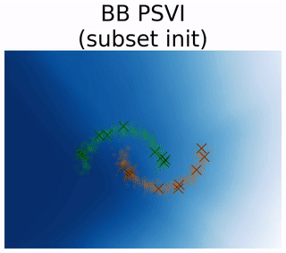
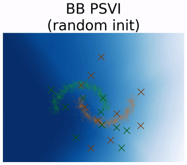
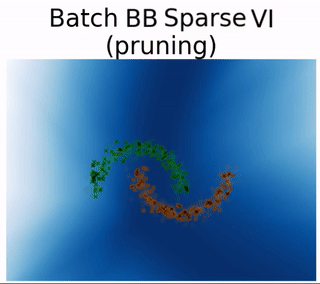
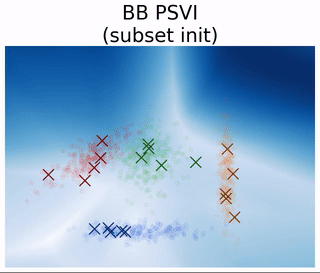
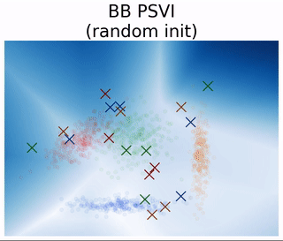
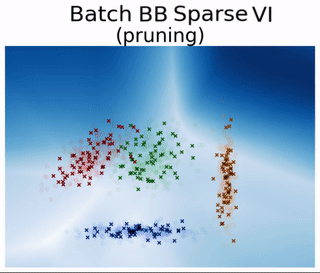
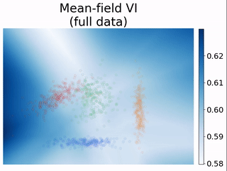

# A library supporting blackbox variational inference via coresets
  

`Blackbox-Coresets-VI` is a library implementing methods for approximate Bayesian inference, which rely on optimizing inside variational families that are constrained to access only a subset of datapoints from a given training dataset (a *coreset*), or a number of summarising pseudodata that are learned jointly with the model over training. Inference via the implemented methods requires specifying a probabilistic model and a training dataset, and can support various parameterisations for the coreset approximation.

## Requirements and installation

* Python version >= 3.9
* PyTorch version >= 1.3

To install `Blackbox-Coresets-VI` from source:
```bash
git clone git@github.com:facebookresearch/Blackbox-Coresets-VI.git
cd Blackbox-Coresets-VI
pip install .
```

Henceforth, the module can be imported at a python script via `import psvi` statements.


## Example usage

### Usecases

The main usecase for the implemented methods is to *fit a given probabilistic model to a given dataset*. Since the model is parameterised via a selected or learned data subset, applications could involve *pruning/compressing or distilling* a large scale dataset to a dataset of a specified smaller size, in a way that the latter acts as a surrogate of the former for the corresponding statistical model.

### Structure of the repository

The library contains implementations of
* inference methods in [`psvi/inference`](psvi/inference),
* probabilistic models in [`psvi/models`](psvi/models), 
* experiment workflows in [`psvi/experiments`](psvi/experiments), and
* notebooks partly demonstrating supported functionalities in [`psvi/notebooks`](psvi/notebooks).

### Experiments execution

Experiments can be executed using the basic command
```bash
python3 psvi/experiments/flow_psvi.py
```
with variations of parseable arguments, and
consist in evaluating a user selected set of inference methods for selected datasets, given a specified probabilistic model. Supported command line arguments include:
* `datasets`: names of input datasets
* `methods`: names of approximate inference methods to be used
* `num_trials`: number of trial repetitions for each inference method per dataset
* `data_minibatch`: size of data minibatches used over training and testing
* `inner_it`: number of inner iterations for each outer gradient step for methods involving bilevel optimization
* `outer_it`: number of outer gradient steps for methods involving bilevel optimization
* `trainer`: method for approximating the outer gradient for inference methods involving bilevel optimization
* `architecture`: specification of the probabilistic model to be used in the experiment (currently supporting the  `logistic_regression` model, and `fn`, `fn2`, `lenet` for feedfoward with diagonal covariance, feedforward with full covariance and LeNet Bayesian neural network architectures respectively)
* `coreset_sizes`: size of coresets used
* `init_at`: initialization of the coreset data support (`subset` to initialise on a subset of existing datapoints, `random` to initialise on a noisy mean of the data distribution)

For example,
```bash
python3 psvi/experiments/flow_psvi.py --datasets "halfmoon" "four_blobs" --architecture "fn" --n_hidden 100 --methods "psvi_learn_v" "mfvi_subset" --coreset_sizes 10 50 --init_at "subsample" --num_trials 3 
```
will execute inference via PSVI with learnable pseudodata weights (`psvi_learn_v`) and mean-field VI (`mfvi_subset`) to fit a feedforward BNN with 100 hidden units in a single hidden layer, via initialising on 10 and 50 datapoints from the original training datasets for the "halfmoon" and "four_blobs" datasets -- each inference trial will be repeated 3 times.

The implementation of gradient descent for bilevel optimization in our library is based on [higher](https://github.com/facebookresearch/higher).

Below we showcase snapshots throughout inference via different methods on synthetic 2-d data using a single hidden layer Bayesian neural network.

   

   


## Get involved

See the [CONTRIBUTING](CONTRIBUTING.md) file for how to help out. Please adhere to our [CODE_OF_CONDUCT](CODE_OF_CONDUCT.md) principles.

## License

The majority of the [Blackbox-Coresets-VI](https://github.com/facebookresearch/Blackbox-Coresets-VI) project is licensed under CC-BY-NC as found in the [LICENCSE](LICENSE) file, however portions of the project are available under separate license terms:
- [`psvi/hypergrad`](psvi/hypergrad) is an edited copy of https://github.com/prolearner/hypertorch and is licensed under the MIT license, and
- [`psvi/robust_higher`](psvi/robust_higher) is an edited copy of https://github.com/facebookresearch/higher and is licensed under the Apache 2.0 license.

## Citation

If you use `Blackbox-Coresets-VI` in your research, please consider citing:

```bib
@article{bbpsvi22,
  title={Black-box Coreset Variational Inference},
  author={Manousakas, Dionysis and Ritter, Hippolyt and Karaletsos, Theofanis},
  journal={35th Conference on Neural Information Processing Systems (NeurIPS)},
  year={2022}
}
```

## Release Notes

See the [CHANGELOG](./CHANGELOG.md) for release notes.
